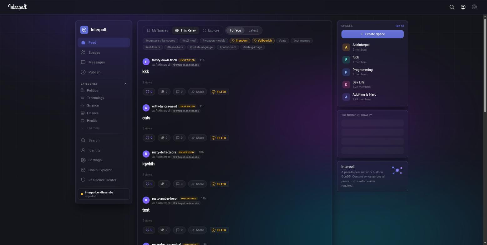
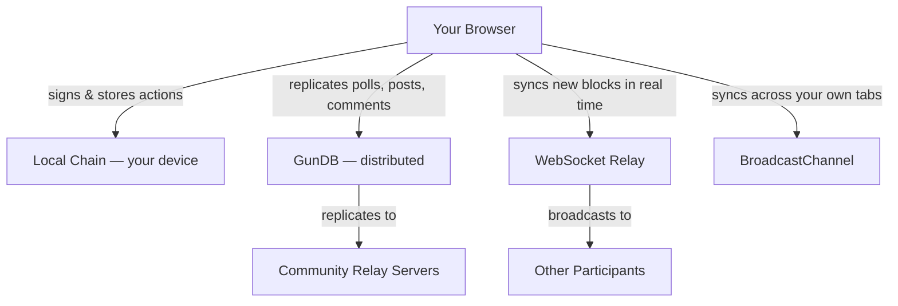
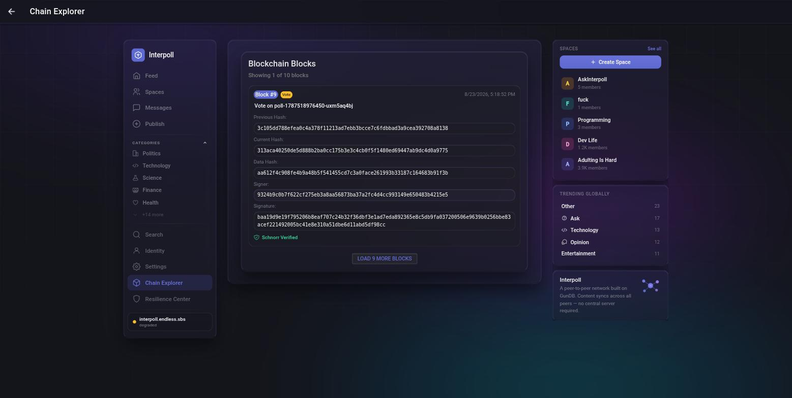
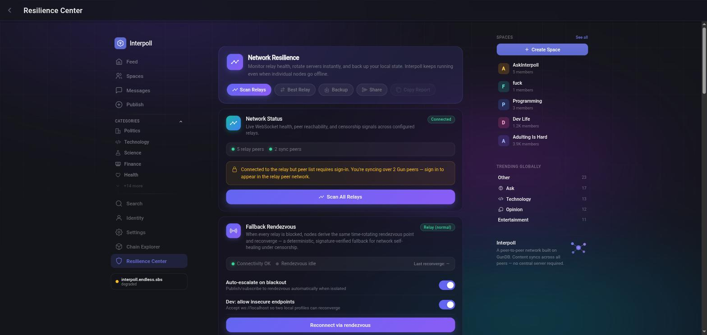
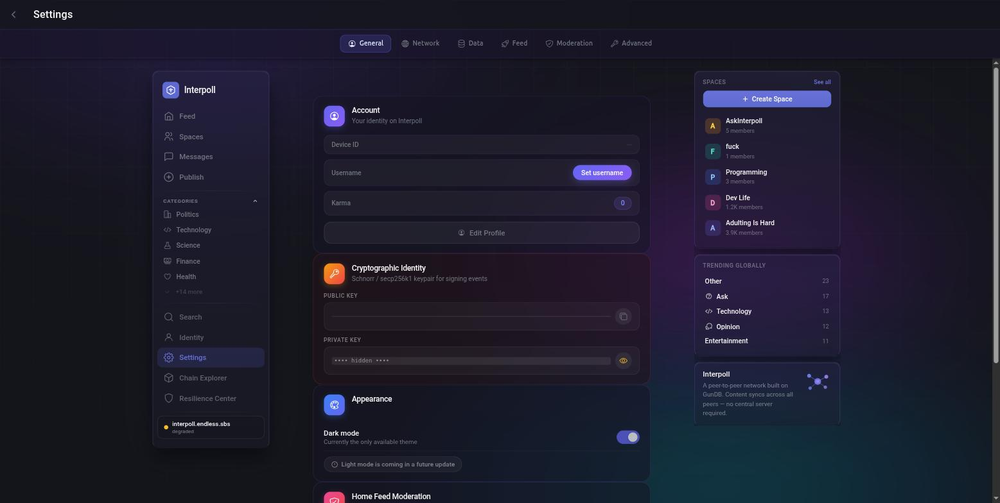
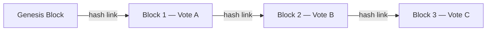

# InterPoll

> Polls, posts, and discussions that no single company can take down.

<p align="center">
  
</p>

---

## So what is this, exactly?

InterPoll is a free, open-source polling and discussion platform where **your data doesn't live on someone else's server**. When you vote, post, or comment, everything is stored on your device first, then replicated across the network. No central database. No single point of failure. No one person who can flip a switch and erase your community's history.

We built it because we kept running into the same problem: platforms censor, shadow-ban, or just quietly remove things. On InterPoll, you create your own community, set your own rules, and no algorithm decides what shows up in your feed. If a relay goes down, the data lives on in every peer that has a copy.

---

## What makes it different

- **Your vote is cryptographically signed.** A key lives on your device and signs every action you take. No relay or server can forge a vote in your name.
- **Every vote chains to the last one.** Tamper with a past record and the chain snaps — visibly. You can verify this yourself in the built-in Chain Explorer.
- **Posts and comments replicate everywhere.** Not locked in a vendor database. They spread across peers and relay servers, and survive as long as anyone holds a copy.
- **Works offline.** Vote without internet. Your data syncs when connectivity comes back.
- **Encrypted communities.** Create spaces where everything is encrypted in your browser. Relay servers see scrambled data — they can't read it even if they wanted to.
- **No algorithm, no shadow-banning.** You see what your community posts. That's it.
- **Anyone can run a relay.** Communities can host their own, giving them full sovereignty over their data.

---

## How it actually works

InterPoll runs on three layers that work together:

**Your local chain** — Every vote and key action gets written to a tamper-evident log right in your browser. Each entry links to the one before it with a cryptographic hash. Change anything and the chain breaks.

**The distributed network** — Polls, posts, comments, communities, and profiles replicate across a peer-to-peer database (GunDB). Every connected device holds a copy. A relay going down doesn't kill the data — it syncs back up when any peer reconnects.

**The relay** — A lightweight WebSocket server helps devices find each other and share updates in real time. Anyone can run one. If one gets blocked, peers switch to another. More relays = more resilience.



> **The short version:** your polls, posts, and vote history exist on your device, your peers' devices, and across relay servers — all at once. Erasing them would mean erasing every copy simultaneously. Sooner or later, a peer with a copy reconnects and reseeds the network.

---

## Chain Explorer

Every vote is part of a verifiable chain. After voting, you get a short verification code — enter it in the Chain Explorer to confirm your vote is intact and hasn't been altered.

<p align="center">
  
</p>

---

## Resilience Center

Monitor your network health, scan for relays, switch to backups instantly, and fall back to a deterministic rendezvous point if every relay gets blocked.

<p align="center">
  
</p>

---

## Cryptographic Identity

Your signing keys are generated and stored locally. Schnorr signatures (secp256k1) prove that every action came from your device — no one can impersonate you.

<p align="center">
  
</p>

---

## Features at a glance

| Feature | What it means |
|---|---|
| **Tamper-evident voting** | Every vote chains to the previous one. Alter a record and the chain breaks visibly. |
| **Verifiable receipts** | Get a code after voting. Check it anytime in the Chain Explorer. |
| **Posts & threaded comments** | Full community discussions — publish updates, debate in comments, keep context attached to each poll. |
| **Offline-first** | Vote without internet. Records sync when you reconnect. |
| **Encrypted communities** | All content encrypted in-browser (AES-256-GCM). Relays see only ciphertext. |
| **Community-run relays** | Any group can host their own relay server for full data sovereignty. |
| **Fallback rendezvous** | When all relays are blocked, nodes derive a shared reconnection point and self-heal. |
| **Optional login gates** | Poll creators can require Google or Microsoft sign-in for verified polls. |
| **Invite-only polls** | Single-use invite codes — each one works exactly once. |
| **Censorship-resistant by design** | The relay can delay messages, but it cannot forge a signed action from your device key. |

---

## Honest about the limits

This is designed to be **harder to censor and tamper with** than a traditional platform — not impossible. Here's what that means in practice:

- Data survives as long as **at least one honest participant** holds a copy and eventually reconnects.
- A relay can **delay or censor** messages, but it **cannot forge** a vote or signed action from your device key.
- Anti-fraud measures (device fingerprinting, two-phase vote authorization, invite codes, OAuth gating) **raise the cost** of duplicate voting. They don't provide mathematical one-person-one-vote guarantees.
- Private community encryption is strong (AES-256-GCM), but if you lose your key, there is no recovery. That's by design.

For the full technical threat model, see the [IPP specification series](docs/protocol/IPP-00-overview.md).

---

## Get involved

**Run a peer** — the simplest way to strengthen the network. Another device running the app means another copy of the data and faster sync for everyone.

```bash
node peer.js
```

**Run a relay** — give your community full data sovereignty. See `gun-relay-server/` for the GunDB relay and `relay-server.js` for the WebSocket relay.

**Contribute** — the project is fully open source. Open a PR.

---

## Quick start

```bash
# Start everything in tmux (recommended)
chmod +x run.sh
./run.sh

# Or run each service manually:
npm run dev              # Vite frontend → http://localhost:5173
node relay-server.js     # WebSocket relay → ws://localhost:8080
cd gun-relay-server && node gun-relay.js  # GunDB relay → http://localhost:8765/gun
```

### Environment variables

**Frontend** (set at build time with `VITE_` prefix):

| Variable | Default | Purpose |
|---|---|---|
| `VITE_WS_RELAY_URL` | `ws://localhost:8080` | WebSocket relay |
| `VITE_GUN_RELAY_URL` | `http://localhost:8765/gun` | GunDB relay |
| `VITE_API_BASE_URL` | `http://localhost:8080` | Backend API |

Relay URLs can also be changed at runtime from Settings (saved in `localStorage`).

**Relay server:**

| Variable | Default | Purpose |
|---|---|---|
| `FRONTEND_ORIGIN` | `http://localhost:5173` | CORS origin |
| `SERVER_ORIGIN` | `http://localhost:8080` | Public relay origin for OAuth callbacks (must be HTTPS in production) |
| `JWT_SECRET` | random per process | HMAC secret for session JWTs |
| `VOTE_RESERVATION_SECRET` | random per process | HMAC secret for vote reservation tokens |
| `GOOGLE_CLIENT_ID` / `GOOGLE_CLIENT_SECRET` | — | Google OAuth (optional) |
| `MS_CLIENT_ID` / `MS_CLIENT_SECRET` / `MS_TENANT` | — | Microsoft OAuth (optional) |

OAuth is optional — only needed for polls that require a login to vote. Use `.env.example` as a template.

### Build commands

```bash
npm run dev       # Dev server
npm run build     # Type-check + production build
npm run preview   # Serve built dist/
npm test          # Vitest test suite
```

---

## Architecture

```
src/
  components/     UI components (VoteForm, PollCard, PostCard, etc.)
  views/          Page-level views (HomePage, PollDetailPage, SettingsPage, etc.)
  services/       Core logic — blockchain, GunDB, WebSocket, crypto, storage
  stores/         Pinia state stores (chainStore, pollStore, communityStore, etc.)
  router/         Vue Router configuration
  composables/    Reusable Vue 3 composition functions
  config.ts       Runtime-mutable relay URLs and app configuration

relay-server.js                          Dev WebSocket relay + OAuth + vote authorization
relay-server/relay-server-enhanced.js   Production relay (PM2, persisted vote registry)
gun-relay-server/                       GunDB relay server
shared-validation/                      Validation shared between frontend and relay
```

### Key services

| Service | What it does |
|---|---|
| `chainService` | Block creation, hashing, signing, chain validation |
| `gunService` | GunDB read/write/subscribe wrapper |
| `websocketService` | WebSocket connection, peer discovery, relay failover |
| `pollService` | Poll CRUD, invite codes |
| `encryptionService` | AES-256-GCM encryption for private communities |
| `keyVaultService` | Local key storage and export/import |
| `cryptoService` | SHA-256 hashing, verification codes |
| `voteTrackerService` | Device fingerprinting, duplicate-vote prevention |
| `storageService` | IndexedDB wrapper for blocks, votes, receipts |

### Vote flow



1. Vote payload is hashed (SHA-256) and a new block is appended, linked to the previous block's hash.
2. The block is signed with your device key and saved locally.
3. A receipt with a verification code is generated.
4. The block is broadcast to peers via WebSocket and BroadcastChannel.
5. The relay's two-phase path (`/api/vote-authorize` → `/api/vote-confirm`) prevents duplicate registration server-side.

### Anti-fraud layers

- **Device fingerprinting** — SHA-256 hash of browser properties → persistent device ID
- **Two-phase authorization** — relay issues a short-lived reservation token; only confirming with it commits the vote
- **Single-use invite codes** — consumed atomically in GunDB
- **Optional OAuth gating** — Google or Microsoft login required to vote
- **Rate limiting and bot scoring** — reduces automated spam
- **Proof-of-Work (optional)** — raises the cost of high-frequency message floods

---

## Protocol spec

For the full technical specification — block structure, vote flow, sync protocol, encryption, relay trust model, and threat model — see the numbered IPP series:

**[`docs/protocol/IPP-00-overview.md`](docs/protocol/IPP-00-overview.md)**

---

## License

Open source. See [LICENSE](LICENSE) for details.
